# Real-Time Forum V2

A modern, real-time forum application built with Go backend and vanilla JavaScript frontend, featuring live chat, post management, and user interactions.


## 📋 Table of Contents

- [Overview](#overview)
- [Architecture](#architecture)
- [Technology Stack](#technology-stack)
- [Project Structure](#project-structure)
- [How It Works](#how-it-works)
- [Features](#features)
- [Installation](#installation)
- [Usage](#usage)
- [API Documentation](#api-documentation)
- [Database Schema](#database-schema)
- [WebSocket Communication](#websocket-communication)

---

## 🎯 Overview

Real-Time Forum V2 is a full-stack web application that enables users to create posts, comment, like/dislike content, and engage in real-time private messaging. The application uses a Go backend with SQLite database and a vanilla JavaScript frontend with WebSocket support for live updates.

---

## 🏗️ Architecture

### High-Level System Architecture

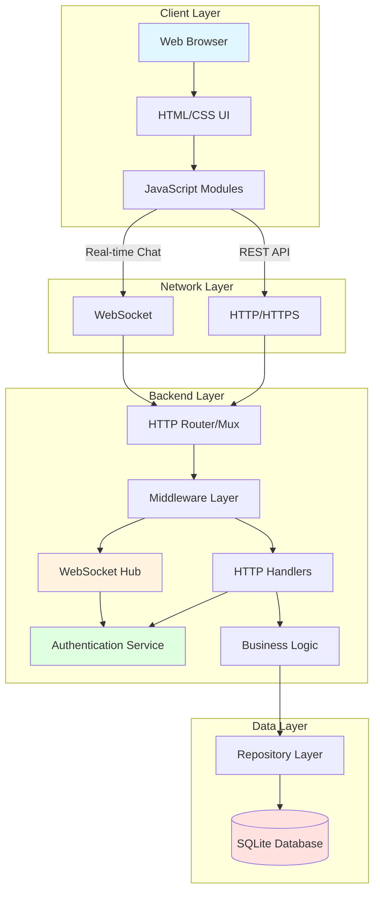

### Backend-Frontend Connection Flow

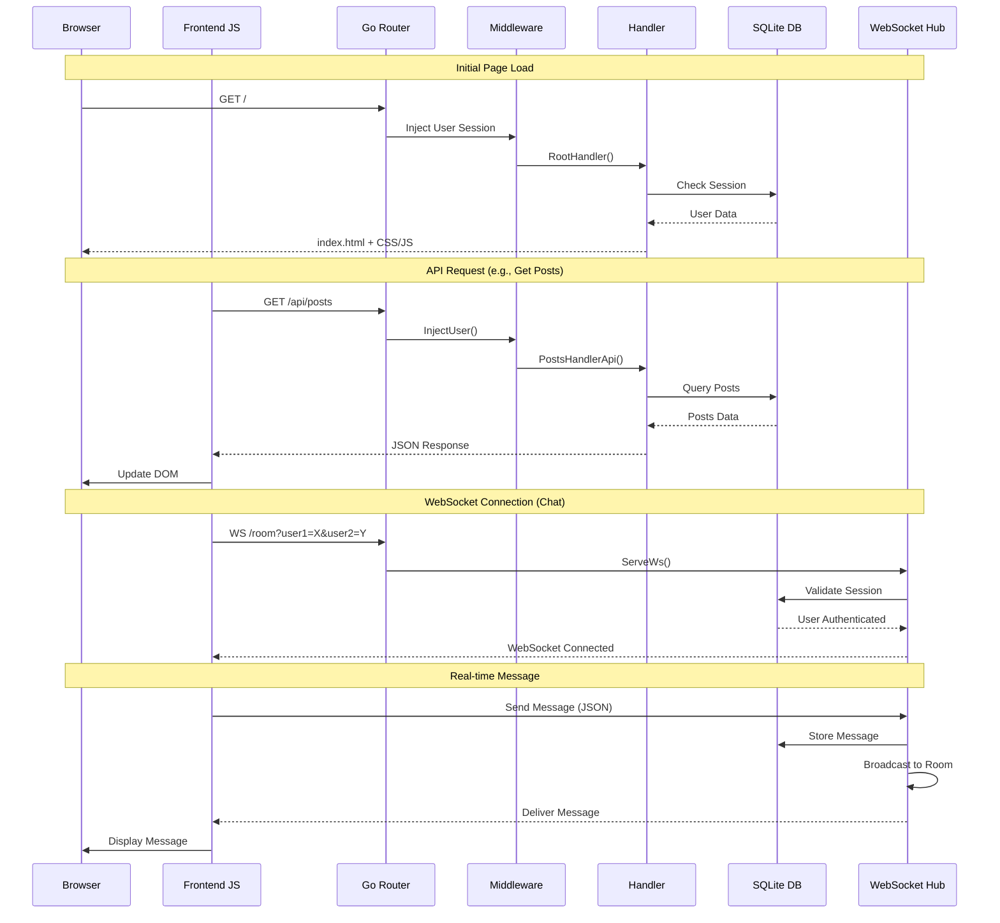

### Component Interaction Diagram

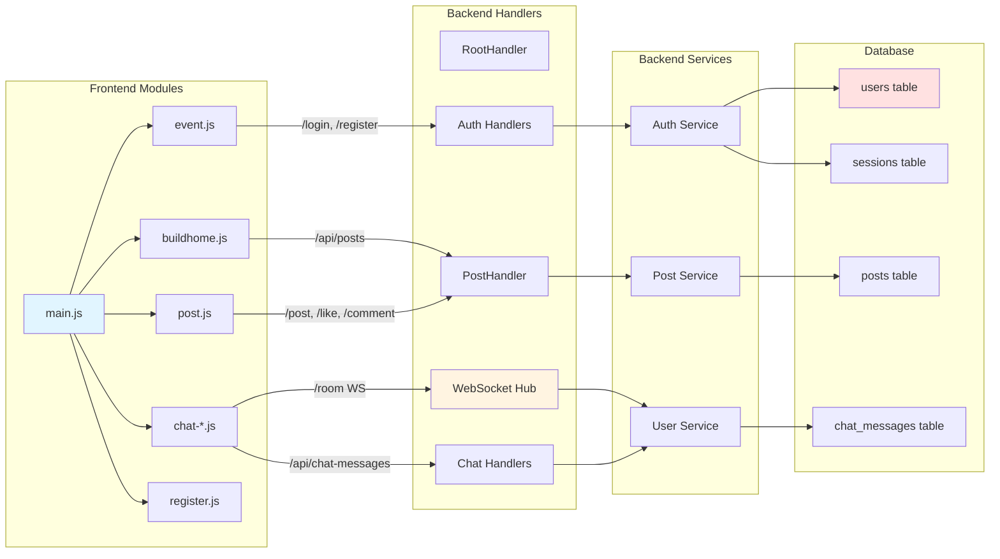

---

## 🛠️ Technology Stack

### Backend
- **Language**: Go 1.24
- **Database**: SQLite 3
- **WebSocket**: Gorilla WebSocket
- **Authentication**: Session-based with bcrypt password hashing
- **Architecture**: Layered architecture (Handler → Service → Repository → Database)

### Frontend
- **Language**: Vanilla JavaScript (ES6+)
- **Styling**: Custom CSS
- **Communication**: Fetch API for REST, WebSocket API for real-time features
- **Module System**: ES6 Modules

### Key Dependencies
```go
require (
    github.com/mattn/go-sqlite3 v1.14.33
    golang.org/x/crypto v0.47.0
    github.com/gorilla/websocket v1.5.3
)
```

---

## 📁 Project Structure

```
Real-Time-Forum-V2/
├── cmd/
│   └── forum/
│       └── main.go                 # Application entry point
├── internal/
│   ├── auth/                       # Authentication logic
│   │   ├── login.go
│   │   ├── register.go
│   │   ├── logout.go
│   │   ├── session.go
│   │   ├── online.go
│   │   └── brodcast.go
│   ├── db/                         # Database operations
│   ├── handler/                    # HTTP request handlers
│   │   ├── FirststateHandler.go   # Initial state API
│   │   ├── PostHandler.go         # Post management
│   │   ├── chathandler.go         # Chat HTTP endpoints
│   │   ├── rooms.go               # WebSocket hub & rooms
│   │   ├── like.go, dislike.go
│   │   ├── comment.go
│   │   ├── profile.go
│   │   └── user.go
│   ├── middleware/                 # HTTP middleware
│   │   ├── auth.go
│   │   ├── inject.go
│   │   └── ratelimiter.go
│   ├── repository/                 # Data access layer
│   ├── service/                    # Business logic
│   │   ├── server.go              # Server setup & routing
│   │   ├── handel_segnals.go
│   │   └── online.go
│   └── utils/                      # Utility functions
├── ui/
│   ├── index.html                  # Main HTML template
│   ├── css/                        # Stylesheets
│   ├── js/                         # JavaScript modules
│   │   ├── main.js                # App initialization
│   │   ├── event.js               # Login/Auth UI
│   │   ├── buildhome.js           # Home page builder
│   │   ├── post.js                # Post detail page
│   │   ├── newpost.js             # Create post UI
│   │   ├── register.js            # Registration UI
│   │   ├── chat-core.js           # Chat core logic
│   │   ├── chat-ui.js             # Chat UI components
│   │   ├── chat-websocket.js      # WebSocket client
│   │   ├── chat-users.js          # User list management
│   │   ├── chat-utils.js          # Chat utilities
│   │   ├── addlistners.js         # Event listeners
│   │   └── setevrntlisnter.js     # Additional listeners
│   ├── svg/                        # SVG assets
│   └── assets/                     # Other assets
├── database/
│   ├── schema.sql                  # Database schema
│   └── forum.db                    # SQLite database file
├── go.mod                          # Go module definition
├── go.sum                          # Go dependencies
├── Makefile                        # Build commands
└── package.json                    # Frontend dependencies
```

---

## ⚙️ How It Works

### 1. Application Startup

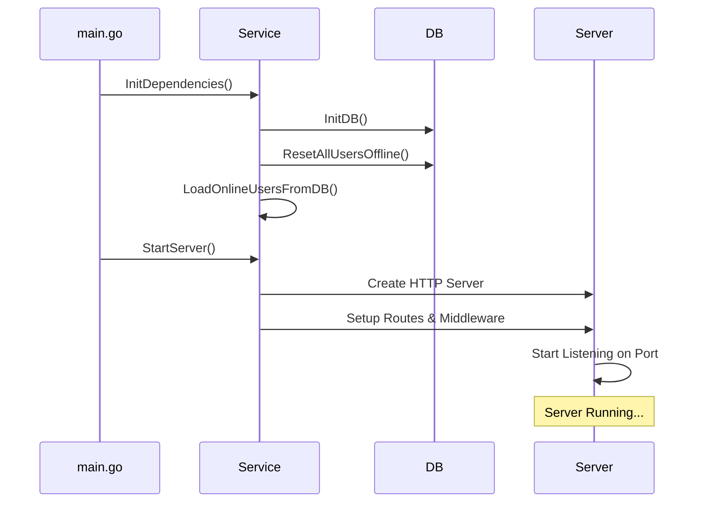

**Steps:**
1. `main.go` calls `service.InitDependencies()`
2. Database is initialized and connected
3. All users are marked offline (cleanup from previous session)
4. Online users are loaded into memory
5. HTTP server is configured with routes and middleware
6. Server starts listening on configured port (default: `:8080`)

### 2. User Authentication Flow

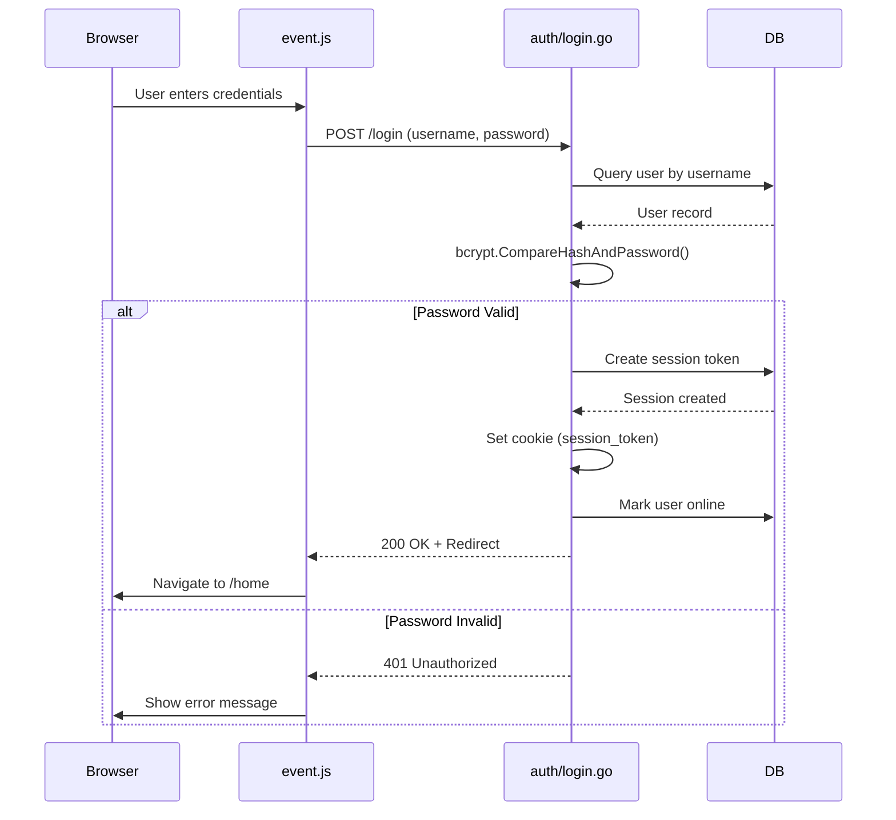

### 3. Page Rendering Flow

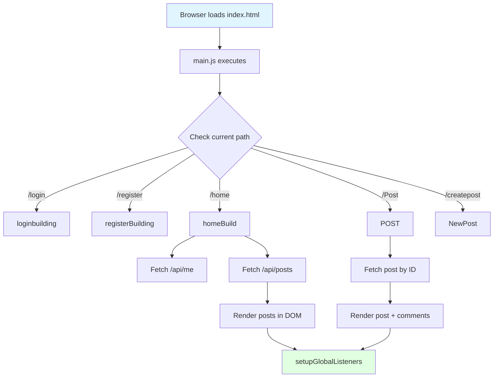

### 4. Real-Time Chat System

The chat system uses WebSocket for bidirectional real-time communication:

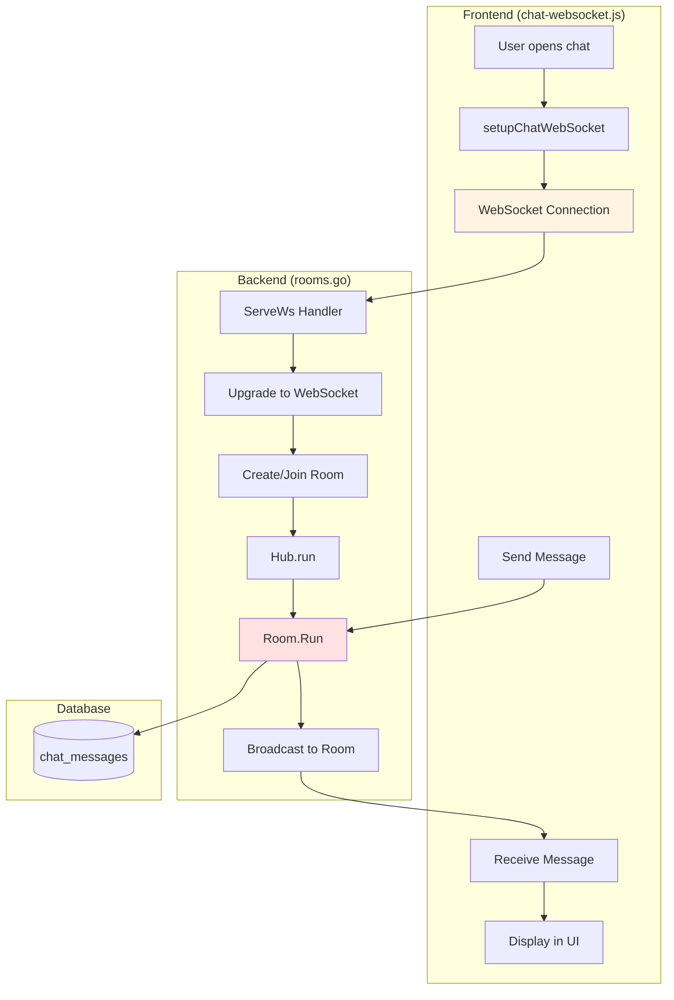

**WebSocket Room System:**
- Each private chat creates a unique room: `CreatePrivateRoomName(user1, user2)`
- Hub manages all rooms and user connections
- Messages are broadcast only to users in the same room
- Messages are persisted to database before broadcasting

### 5. Post Creation & Interaction

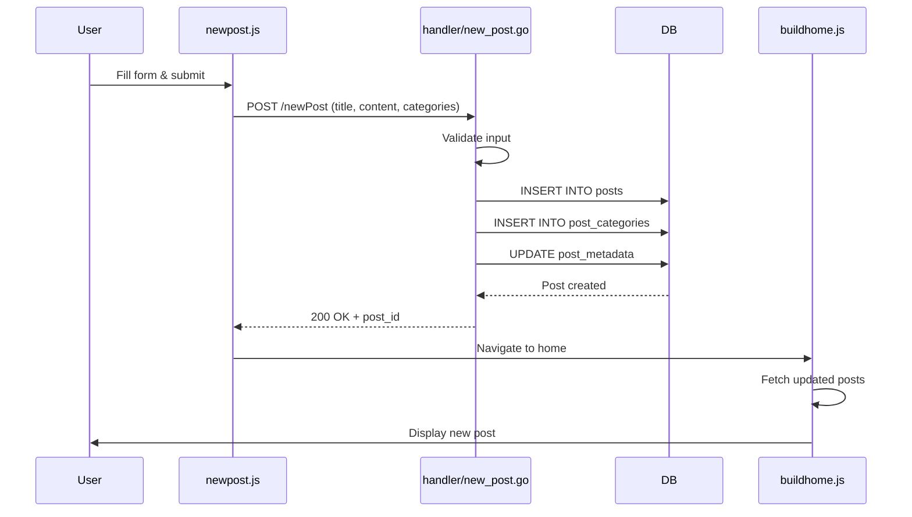

### 6. Middleware Pipeline

Every HTTP request goes through middleware layers:

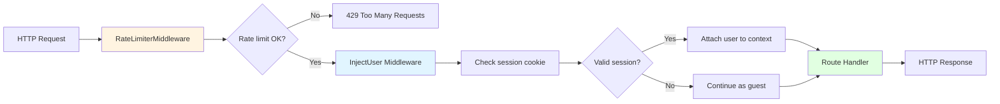

**Middleware Functions:**
1. **RateLimiterMiddleware**: Limits requests to 15 per 30 seconds per IP
2. **InjectUser**: Validates session and injects user data into request context
3. **AuthMiddleware**: Blocks unauthenticated users from protected routes

---

## ✨ Features

### User Management
- ✅ User registration with validation
- ✅ Secure login with bcrypt password hashing
- ✅ Session-based authentication
- ✅ User profiles with additional information (age, gender, name)
- ✅ Online/offline status tracking

### Forum Features
- ✅ Create posts with title, content, and categories
- ✅ View all posts with pagination
- ✅ View individual post details
- ✅ Comment on posts
- ✅ Like/dislike posts and comments
- ✅ Category-based filtering
- ✅ Post metadata (like count, comment count)

### Real-Time Chat
- ✅ Private one-on-one messaging
- ✅ WebSocket-based real-time delivery
- ✅ Typing indicators
- ✅ Message read status
- ✅ Unread message count
- ✅ Recent chats list
- ✅ Online user list
- ✅ Message history with pagination

### Security & Performance
- ✅ Rate limiting (15 requests per 30 seconds)
- ✅ SQL injection protection (prepared statements)
- ✅ XSS protection
- ✅ Session expiration
- ✅ CORS handling
- ✅ Graceful shutdown

---

## 🚀 Installation

### Prerequisites
- Go 1.24 or higher
- SQLite 3
- Node.js (for frontend tooling, optional)

### Steps

1. **Clone the repository**
```bash
git clone https://github.com/yourusername/Real-Time-Forum-V2.git
cd Real-Time-Forum-V2
```

2. **Initialize the database**
```bash
sqlite3 database/forum.db < database/schema.sql
```

3. **Install Go dependencies**
```bash
go mod download
```

4. **Build and run**
```bash
# Using Makefile
make run-backend

# Or directly with Go
go run cmd/forum/main.go
```

5. **Access the application**
```
Open your browser and navigate to: http://localhost:8080
```

---

## 📖 Usage

### Starting the Server

```bash
# Start backend only
make run-backend

# Or use go run
go run cmd/forum/main.go
```

### Creating a User

1. Navigate to `/register`
2. Fill in the registration form:
   - Username
   - Email
   - Password
   - First Name, Last Name
   - Age, Gender
3. Submit the form
4. You'll be redirected to login

### Creating a Post

1. Log in to your account
2. Click "Create Post" or navigate to `/createpost`
3. Enter title, content, and select categories
4. Submit the post
5. Your post will appear on the home page

### Starting a Chat

1. Log in to your account
2. Click on the chat icon
3. Select a user from the online users list
4. Start typing and sending messages
5. Messages are delivered in real-time via WebSocket

---

## 📡 API Documentation

### Authentication Endpoints

| Method | Endpoint | Description | Auth Required |
|--------|----------|-------------|---------------|
| POST | `/login` | User login | No |
| POST | `/register` | User registration | No |
| GET | `/logout` | User logout | Yes |

### User Endpoints

| Method | Endpoint | Description | Auth Required |
|--------|----------|-------------|---------------|
| GET | `/api/me` | Get current user info | No (returns guest if not authenticated) |
| GET | `/api/online-users` | Get list of online users | Yes |
| GET | `/api/all-users` | Get all users | Yes |
| GET | `/api/user-by-username` | Get user by username | No |

### Post Endpoints

| Method | Endpoint | Description | Auth Required |
|--------|----------|-------------|---------------|
| GET | `/api/posts` | Get all posts (paginated) | No |
| GET | `/post?id={id}` | Get single post details | No |
| POST | `/newPost` | Create new post | Yes |
| POST | `/like` | Like a post | Yes |
| POST | `/dislike` | Dislike a post | Yes |
| POST | `/comment` | Add comment to post | Yes |

### Chat Endpoints

| Method | Endpoint | Description | Auth Required |
|--------|----------|-------------|---------------|
| GET | `/api/chat-messages` | Get chat messages between users | Yes |
| GET | `/api/recent-chats` | Get recent chat conversations | Yes |
| GET | `/api/unread-count` | Get unread message count | Yes |
| GET | `/api/last-messages` | Get last messages for all chats | Yes |

### WebSocket Endpoints

| Endpoint | Description | Auth Required |
|----------|-------------|---------------|
| WS `/room?user1={u1}&user2={u2}` | Private chat room | Yes |
| WS `/notifications` | Global notifications | Yes |

### Example API Requests

**Get Posts:**
```javascript
const response = await fetch('/api/posts?page=1&limit=10');
const data = await response.json();
// Returns: { posts: [...], total: 100, page: 1, limit: 10 }
```

**Create Post:**
```javascript
const response = await fetch('/newPost', {
  method: 'POST',
  headers: { 'Content-Type': 'application/json' },
  body: JSON.stringify({
    title: 'My Post',
    content: 'Post content here',
    categories: [1, 2, 3]
  })
});
```

**WebSocket Chat:**
```javascript
const ws = new WebSocket('ws://localhost:8080/room?user1=alice&user2=bob');
ws.onmessage = (event) => {
  const data = JSON.parse(event.data);
  console.log('Message:', data.message);
};
ws.send(JSON.stringify({
  type: 'message',
  message: 'Hello!',
  name: 'alice'
}));
```

---

## 🗄️ Database Schema

### Entity Relationship Diagram

```mermaid
erDiagram
    users ||--o{ sessions : has
    users ||--o{ posts : creates
    users ||--o{ comments : writes
    users ||--o{ likes_dislikes : makes
    users ||--o{ comment_likes_dislikes : makes
    users ||--o{ chat_messages : sends
    users ||--o{ chat_messages : receives
    users ||--o{ user_profiles : has
    
    posts ||--o{ comments : has
    posts ||--o{ likes_dislikes : receives
    posts ||--o{ post_categories : belongs_to
    
    comments ||--o{ comment_likes_dislikes : receives
    
    categories ||--o{ post_categories : has
    
    users {
        int id PK
        string username UK
        string email UK
        string password_hash
        string first_name
        string last_name
        int age
        string gender
        boolean online
        datetime created_at
        datetime updated_at
    }
    
    sessions {
        int id PK
        int user_id FK
        string session_token UK
        datetime expires_at
        datetime created_at
    }
    
    posts {
        int id PK
        int user_id FK
        string title
        text content
        datetime created_at
        datetime updated_at
    }
    
    comments {
        int id PK
        int user_id FK
        int post_id FK
        text comment
        datetime created_at
    }
    
    likes_dislikes {
        int id PK
        int user_id FK
        int post_id FK
        boolean is_like
        boolean is_dislike
        datetime created_at
    }
    
    categories {
        int id PK
        string name UK
    }
    
    post_categories {
        int post_id FK
        int category_id FK
    }
    
    chat_messages {
        int id PK
        int sender_id FK
        int receiver_id FK
        text message
        int created_at
        boolean is_read
    }
    
    user_profiles {
        int user_id PK_FK
        int age
        string gender
        string first_name
        string last_name
        datetime created_at
        datetime updated_at
    }
```

### Key Tables

**users**: Stores user account information
- Primary authentication table
- Tracks online status
- Contains basic profile info

**sessions**: Manages user sessions
- Session token for authentication
- Expiration tracking
- One-to-many relationship with users

**posts**: Forum posts
- User-generated content
- Linked to users via `user_id`
- Supports categories via junction table

**chat_messages**: Private messages
- Sender and receiver relationship
- Read status tracking
- Indexed for performance

**likes_dislikes**: Post reactions
- Unique constraint on (user_id, post_id)
- Separate boolean flags for like/dislike

---

## 🔌 WebSocket Communication

### Connection Flow

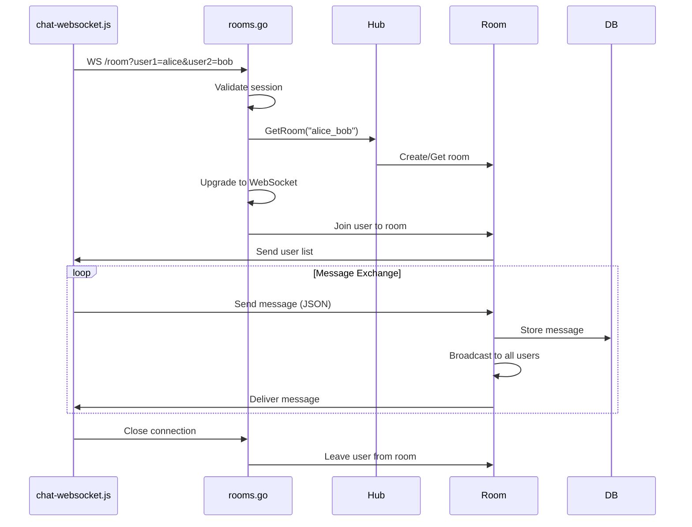

### Message Format

**Client → Server (Send Message):**
```json
{
  "type": "message",
  "name": "alice",
  "message": "Hello, Bob!"
}
```

**Server → Client (Receive Message):**
```json
{
  "type": "message",
  "name": "alice",
  "message": "Hello, Bob!",
  "sender_id": 1,
  "created_at": "2026-02-08T15:30:00Z"
}
```

**Server → Client (User List):**
```json
{
  "type": "users",
  "users": ["alice", "bob"]
}
```

**Typing Indicator:**
```json
{
  "type": "typing",
  "name": "alice",
  "isTyping": true
}
```

### WebSocket Hub Architecture

The Hub manages all WebSocket connections and rooms:

- **Hub**: Central manager for all rooms and connections
  - Maintains map of rooms
  - Broadcasts global notifications
  - Manages user connections

- **Room**: Represents a private chat between two users
  - Unique name: `CreatePrivateRoomName(user1, user2)`
  - Maintains list of connected users
  - Handles message broadcasting within room

- **User**: Represents a WebSocket connection
  - Linked to database user
  - Has send/receive channels
  - Handles read/write operations

---

## 🎨 Frontend Architecture

### Module Breakdown

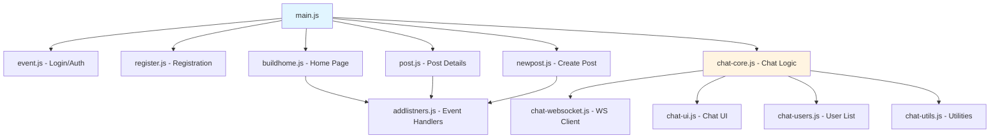

### Key Frontend Modules

| Module | Responsibility |
|--------|---------------|
| `main.js` | App initialization, routing, page management |
| `event.js` | Login page UI and authentication |
| `register.js` | Registration form and validation |
| `buildhome.js` | Home page rendering, post list |
| `post.js` | Single post view, comments, likes |
| `newpost.js` | Post creation form |
| `chat-core.js` | Chat initialization and state |
| `chat-websocket.js` | WebSocket connection management |
| `chat-ui.js` | Chat UI rendering and updates |
| `chat-users.js` | User list, online status |
| `addlistners.js` | Global event listeners |

### State Management

The frontend uses a simple state management approach:
- `sessionStorage` for temporary data (current post ID, current page)
- `localStorage` for persistent preferences
- In-memory state in modules for UI state
- Server as source of truth (fetch on page load)

---

## 🔒 Security Features

### Authentication
- **Password Hashing**: bcrypt with salt
- **Session Management**: Secure session tokens with expiration
- **Cookie Security**: HttpOnly cookies (can be enhanced with Secure flag)

### Input Validation
- **Backend Validation**: All inputs validated before database operations
- **SQL Injection Protection**: Prepared statements for all queries
- **XSS Protection**: Content sanitization (should be enhanced)

### Rate Limiting
- **Request Limiting**: 15 requests per 30 seconds per IP
- **Prevents**: Brute force attacks, spam, DoS

### Authorization
- **Middleware**: `AuthMiddleware` protects sensitive routes
- **Session Validation**: Every protected endpoint checks session
- **User Context**: User data injected into request context

---

## 🧪 Testing

### Manual Testing

1. **User Registration & Login**
   - Register a new user
   - Verify email uniqueness
   - Login with credentials
   - Check session persistence

2. **Post Creation & Interaction**
   - Create a post with categories
   - Like/dislike the post
   - Add comments
   - Verify counts update

3. **Real-Time Chat**
   - Open two browser windows
   - Login as different users
   - Start a chat
   - Send messages and verify real-time delivery
   - Test typing indicators

4. **Error Handling**
   - Test invalid login
   - Test rate limiting (send >15 requests quickly)
   - Test unauthorized access to protected routes

---

## 🚧 Future Enhancements

- [ ] Add unit tests for backend handlers
- [ ] Add integration tests for API endpoints
- [ ] Implement frontend testing (Jest/Vitest)
- [ ] Add image upload for posts and profiles
- [ ] Implement email verification
- [ ] Add password reset functionality
- [ ] Enhance XSS protection with CSP headers
- [ ] Add HTTPS support
- [ ] Implement post editing and deletion
- [ ] Add search functionality
- [ ] Implement notifications for mentions
- [ ] Add emoji support in chat
- [ ] Implement file sharing in chat
- [ ] Add user blocking/reporting
- [ ] Implement admin panel
- [ ] Add analytics and logging

---

## 📄 License

This project is licensed under the MIT License.

---

## 👥 Contributing

Contributions are welcome! Please follow these steps:

1. Fork the repository
2. Create a feature branch (`git checkout -b feature/amazing-feature`)
3. Commit your changes (`git commit -m 'Add amazing feature'`)
4. Push to the branch (`git push origin feature/amazing-feature`)
5. Open a Pull Request

---

## 📞 Support

For issues, questions, or suggestions, please open an issue on GitHub.

---

**Built with ❤️ using Go and JavaScript**
